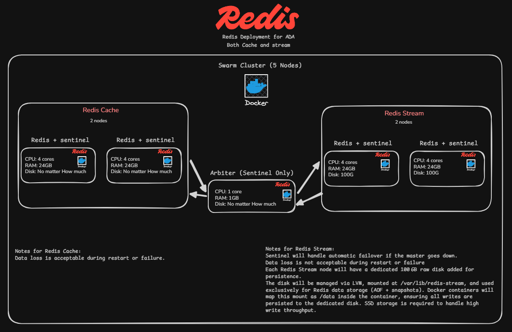

# Redis Sentinel High-Availability Setup on Docker Swarm

This document describes the deployment and operation of two Redis Sentinel‑based high‑availability clusters within a five‑node Docker Swarm. The setup consists of:

- **Redis Stream HA** – a master‑replica pair with three Sentinels (two co‑located with Redis, one dedicated arbiter).
- **Redis Cache HA** – a master‑replica pair with three Sentinels (two co‑located with Redis, one dedicated arbiter).

All commands use placeholders for IP addresses, tokens, and passwords. Replace them with your actual values before execution.

---

## 1. Infrastructure Overview

| Node Hostname   | Role                                              | Labels                                                                                                                                                          |
|-----------------|---------------------------------------------------|------------------------------------------------------------------------------------------------------------------------------------------------------------------|
| `redis-1`       | Redis Stream (master/replica), Sentinel 1        | `redis_name=redis-stream-1`, `redis_sentinel_name=redis-sentinel-1`, `machine_disk=true`, `datacenter=jordan`                                                   |
| `redis-2`       | Redis Stream (master/replica), Sentinel 2        | `redis_name=redis-stream-2`, `redis_sentinel_name=redis-sentinel-2`, `machine_disk=true`, `datacenter=lct`                                                      |
| `redis-cache-1` | Redis Cache (master/replica), Cache Sentinel 1   | `redis_name=redis-cache-1`, `redis_sentinel_name=redis-cache-sentinel-1`, `datacenter=jordan`                                                                   |
| `redis-cache-2` | Redis Cache (master/replica), Cache Sentinel 2   | `redis_name=redis-cache-2`, `redis_sentinel_name=redis-cache-sentinel-2`, `datacenter=lct`                                                                      |
| `redis-arbiter` | Arbiter Sentinel (Cache HA quorum only)          | `redis_sentinel_name=arbiter` (no `redis_name` label – dedicated Sentinel instance)                                                                             |

All five machines are members of a single Docker Swarm. The first node (`redis-1` or any chosen node) acts as the initial manager.

---

## 2. Swarm Cluster Initialisation

### 2.1 Create the Swarm

On the first manager node, run:

```bash
docker swarm init --advertise-addr <NODE_IP>
```

**What it does:** Initialises a new Swarm on the current node using the given IP address for internal communication. The node becomes the first manager.

### 2.2 Join Worker/Manager Nodes

On every other machine, execute the join command obtained from the manager:

```bash
docker swarm join --token <SWARM_JOIN_TOKEN> <MANAGER_IP>:2377
```

**What it does:** Adds the local node to the Swarm as a worker. Replace `<SWARM_JOIN_TOKEN>` with the token provided by `docker swarm init` and `<MANAGER_IP>` with the manager’s IP.

### 2.3 Promote Additional Manager Nodes (for high availability)

To ensure Swarm management survives a manager failure, promote two more nodes:

```bash
docker node promote redis-cache-2
docker node promote redis-arbiter
```

**What it does:** Changes the role of the named nodes from worker to manager, increasing the number of Swarm manager replicas. This is independent of the Redis configuration.

---

## 3. Node Labeling

Labels are used to constrain Redis and Sentinel services to specific hosts. Apply them to the Swarm nodes as follows.

### 3.1 Label the Stream Nodes

```bash
docker node update --label-add redis_name=redis-stream-1 \
                   --label-add redis_sentinel_name=redis-sentinel-1 \
                   --label-add machine_disk=true \
                   --label-add datacenter=jordan \
                   redis-1

docker node update --label-add redis_name=redis-stream-2 \
                   --label-add redis_sentinel_name=redis-sentinel-2 \
                   --label-add machine_disk=true \
                   --label-add datacenter=lct \
                   redis-2
```

**What it does:** Assigns unique identifiers for Redis instances and Sentinel instances, marks the nodes as having persistent disk (`machine_disk=true`), and tags their physical datacenter. These labels are later used in Docker service placement constraints.

### 3.2 Label the Cache Nodes

```bash
docker node update --label-add redis_name=redis-cache-1 \
                   --label-add redis_sentinel_name=redis-cache-sentinel-1 \
                   --label-add datacenter=jordan \
                   redis-cache-1

docker node update --label-add redis_name=redis-cache-2 \
                   --label-add redis_sentinel_name=redis-cache-sentinel-2 \
                   --label-add datacenter=lct \
                   redis-cache-2
```

**What it does:** Provides per‑node identifiers for the cache Redis and its co‑located Sentinel. The `machine_disk` label is omitted because cache data may be ephemeral.

### 3.3 Label the Arbiter Node

```bash
docker node update --label-add redis_sentinel_name=arbiter redis-arbiter
```

**What it does:** Marks the node that will run a standalone Sentinel instance (no Redis process) required to form a quorum of three for the Cache HA Sentinel cluster.

### 3.4 Verify Labels

```bash
docker node inspect $(docker node ls -q) \
  --format '{{.Description.Hostname}} -> {{range $k,$v := .Spec.Labels}}{{$k}}={{$v}} {{end}}'
```

**What it does:** Iterates over all nodes and prints their hostname together with every assigned label, allowing you to confirm the labelling is correct.

---

## 4. Stack Deployment

A `docker-stack.yml` file (not included here) defines all services, networks, volumes, and placement constraints. Deploy it with:

```bash
docker stack deploy -c docker-stack.yml <stack-name>
```

**What it does:** Creates (or updates) a stack consisting of the Redis instances, Sentinels, and their associated overlay networks. All services are started on the appropriate nodes according to the labels.

---

## 5. Monitoring the Stack

### 5.1 List All Stacks

```bash
docker stack ls
```

**What it does:** Shows every stack currently running in the Swarm, including the one just deployed.

### 5.2 Inspect a Specific Stack

```bash
docker stack ps <stack-name>
```

**What it does:** Displays the current state and history of all tasks (containers) belonging to the given stack. Useful to verify that each service has been placed on the correct node.

### 5.3 List All Services

```bash
docker service ls
```

**What it does:** Outputs a summary of all services across all stacks, including their replica count and mode.

### 5.4 Remove a Stack

```bash
docker stack rm <stack-name>
```

**What it does:** Tears down the entire stack: removes all services, networks, and secrets associated with it. Use with caution.

---

## 6. Connecting to Redis Instances

### 6.1 Using Swarm Service Names

Service names follow the pattern `<redis_name>.<overlay_network>`. For example:

```bash
# Connect to the Cache HA master/replica via its overlay network
redis-cli -h redis-cache-1.redis-cache-ha_redis-cache-net --user admin -a <ADMIN_PASSWORD>
redis-cli -h redis-cache-2.redis-cache-ha_redis-cache-net --user admin -a <ADMIN_PASSWORD>

# Connect to the Stream HA instances
redis-cli -h redis-1.redis-ha_redis-net --user admin -a <ADMIN_PASSWORD>
redis-cli -h redis-2.redis-ha_redis-net --user admin -a <ADMIN_PASSWORD>
```

**What it does:** Uses the Swarm DNS‑based service discovery to reach a Redis container. The hostname includes the service name and the network alias. Replace `<ADMIN_PASSWORD>` with the Redis admin password.

### 6.2 Using Direct IP and Port

If you prefer to connect via the host IP and published ports:

```bash
# Stream nodes
redis-cli -h <NODE_IP_REDIS_1> -p 6379 --user admin -a <ADMIN_PASSWORD>
redis-cli -h <NODE_IP_REDIS_2> -p 6379 --user admin -a <ADMIN_PASSWORD>

# Cache nodes (example addresses)
redis-cli -h <NODE_IP_REDIS_CACHE_1> -p 6379 --user admin -a <ADMIN_PASSWORD>
redis-cli -h <NODE_IP_REDIS_CACHE_2> -p 6379 --user admin -a <ADMIN_PASSWORD>
```

**What it does:** Connects to the Redis server listening on the host’s port 6379. The actual IP depends on the node where the container is scheduled.

---

## 7. Sentinel Operations

### 7.1 Connect to a Sentinel

```bash
redis-cli -h <NODE_IP_SENTINEL> -p 26379 --user sentinel -a <SENTINEL_PASSWORD>
```

**What it does:** Opens a CLI session to a Sentinel process. Replace `<NODE_IP_SENTINEL>` with the IP of a node running a Sentinel container (e.g., `redis-cache-1` or `redis-arbiter`). The Sentinel requires its own authentication user and password.

### 7.2 Get Current Master Address

Inside a Sentinel CLI:

```
SENTINEL get-master-addr-by-name mymaster
```

**What it does:** Returns the IP and port of the current master for the monitored set named `mymaster`. The master name is defined in the Sentinel configuration (in the stack file).

### 7.3 Initiate a Manual Failover for when failover didn't work.

```bash
redis-cli -h <NODE_IP_SENTINEL> -p 26379 -a <SENTINEL_PASSWORD> --user sentinel sentinel failover mymaster
```

**What it does:** Forces Sentinel to start a failover immediately, regardless of whether the master is available. This is useful for maintenance or testing. Use with caution in production.

---

## 8. Important Notes

- Replace `<NODE_IP>`, `<MANAGER_IP>`, `<SWARM_JOIN_TOKEN>`, `<ADMIN_PASSWORD>`, `<SENTINEL_PASSWORD>` and any other placeholders with your actual values.
- The passwords shown in the examples should be strong and different for admin and sentinel users.
- The `docker-stack.yml` file must be present on the manager node. It defines the two Redis/Sentinel clusters and should reference the node labels shown above for placement constraints.
- The arbiter Sentinel (on `redis-arbiter`) participates **only** in the Cache HA quorum, not in the Stream HA setup. Ensure your stack file reflects this.
- Change default passwords that exist in the config files for security.
---

### HLD:
